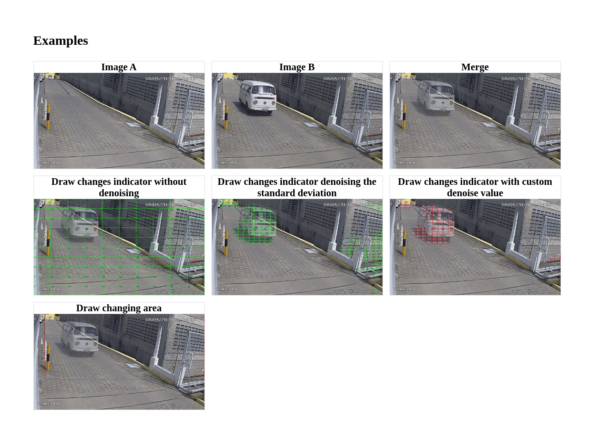

php-image
=========
A library for doing simple things with images in PHP


# Trying

```sh
  git clone https://github.com/gustavonovaes/php-image
  cd php-image
  docker-compose run -p 8080:8080 -S 0.0.0.0:8080 -t examples/ 
```

Open [http://localhost:8080](http://localhost:8080)

# Examples



## Merging 2 images
```php
$imageA = Image::fromFile("a.png");
$imageB = Image::fromFile("b.png");

$result = $imageA->merge($imageB);

$result->save("result.png");
// or base64()}" />
```
## Compare changes

### Draws a square around the changes
```php
$a = Image::fromFile("a.png");
$b = Image::fromFile("b.png");

// Number of parts that the image will be separated to be compared with
$cellsCount = 10;

// If should merge the compared images in the result image
$mergeImages = true;

$comparator = new ImageComparator(
  $a,
  $b,
  $cellsCount,
  $mergeImages
);

$result = $comparator
  // ->denoise(42) // Specify a custom denoise value
  ->denoiseStandardDeviation()
  ->drawChaningArea();
  ->getImage();

$result->save("result.png");
```

### Draws changes indicators
```php
...

$result = $comparator
  ->drawChangesIndicators();
  ->getImage();

$compression = 80;
$result->saveJpeg("result.jpg", $compression);
```

## Supported types
- PNG
- JPEG
